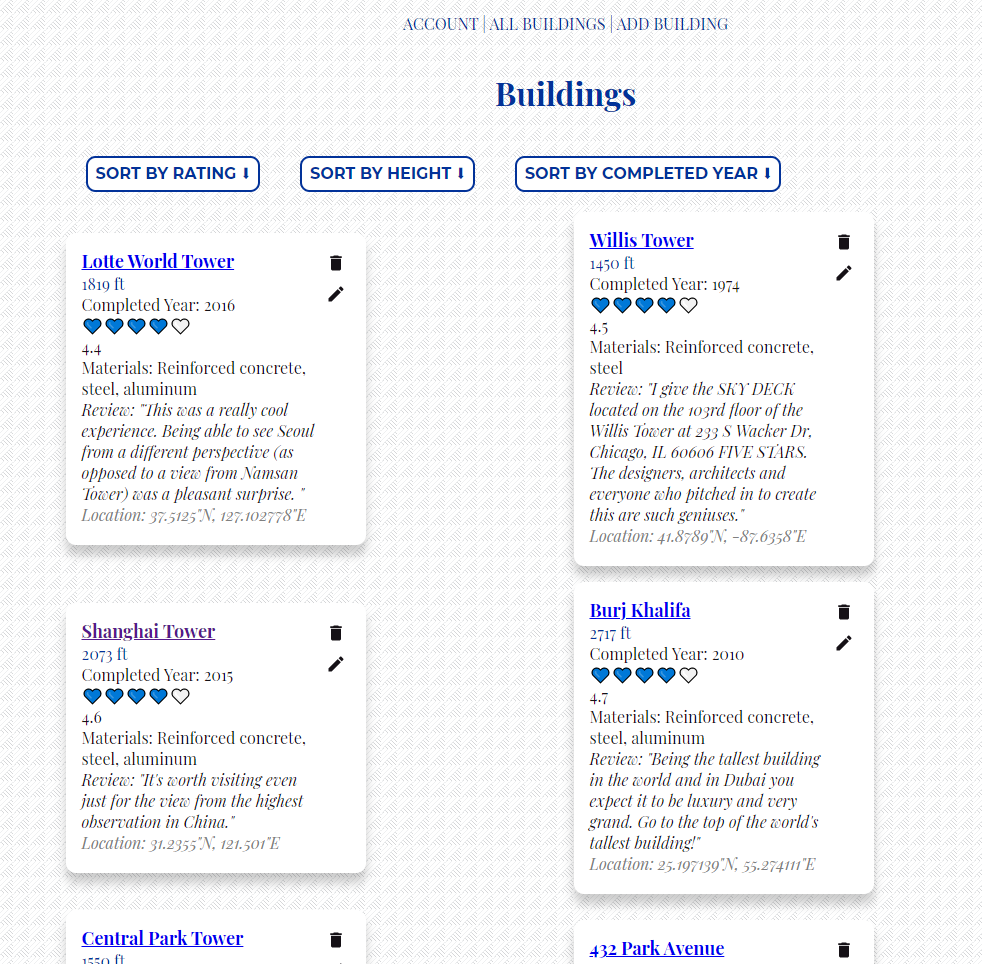
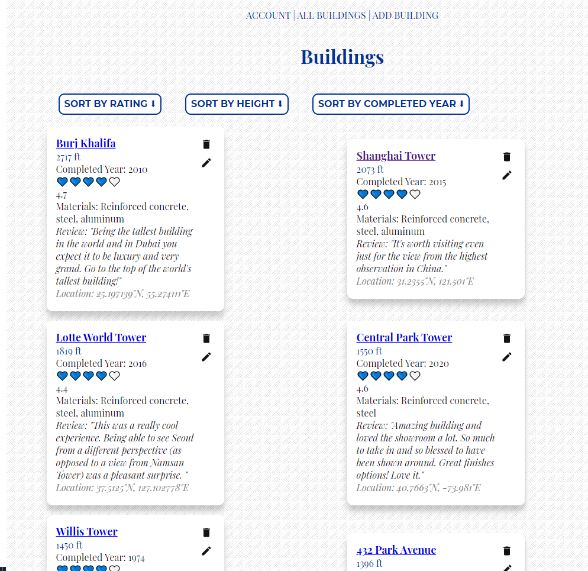
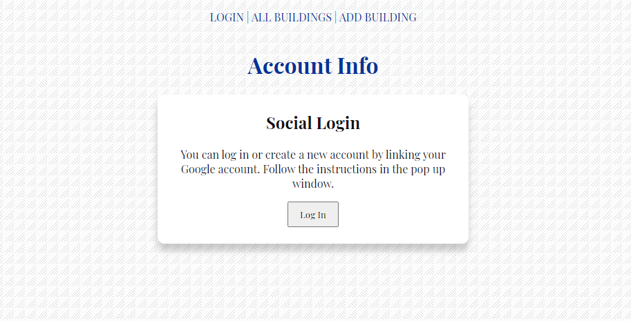
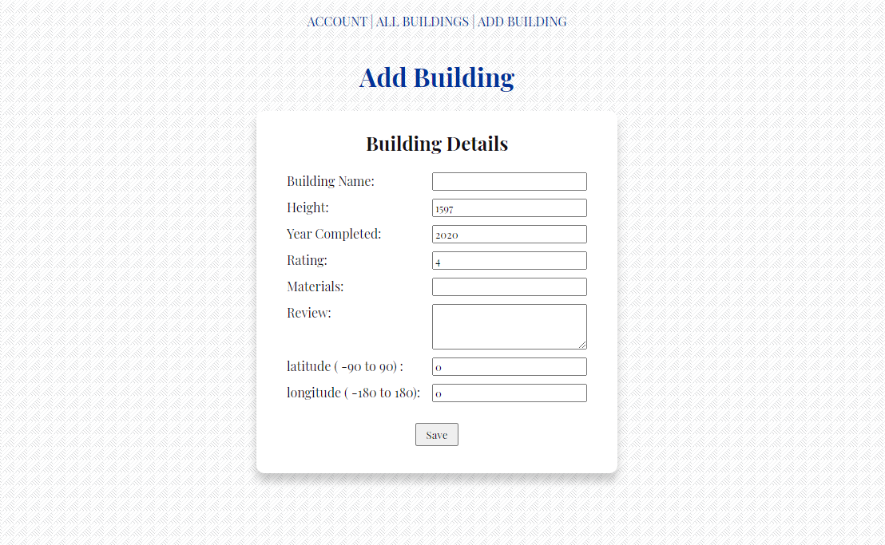

# Skyscrapers App Introduction

This final project called [Skyscrapers Rating App](https://firebase-skyscrapers-app.vercel.app/).

## Motivation for the app

This project will show the existing skyscrapers in the world. These buildings enhance every city's skyline. Users will not only be able to learn about the different buildings around the world through this project, but they can also edit the information by editing, adding, or deleting them.

In this project, users will be able to see the name and the height of the buildings. Also, they can find the completion time and rating of these buildings. It will also show users' comments about some buildings and the structural system of them, but these are optional.

### Current status of the app - what's build and what remains to be built

- Users can click on the inputted building name to jump to google maps to view the location of the building.
- Users can add the GeoPoint data in the app.
- Added a login page. Users can add, edit and delete the buildings information by themselves.
- The information created by the user can only be seen by himself and requires login to see it.
- Users can sort building's height, rating of the building and complete year of the building by descending order.
- Project has the features of CRUD database operations.

- If the user enters latitude and longitude values beyond -90 and 90 or -180 and 180, the page will crush.

### A quick view of the app

